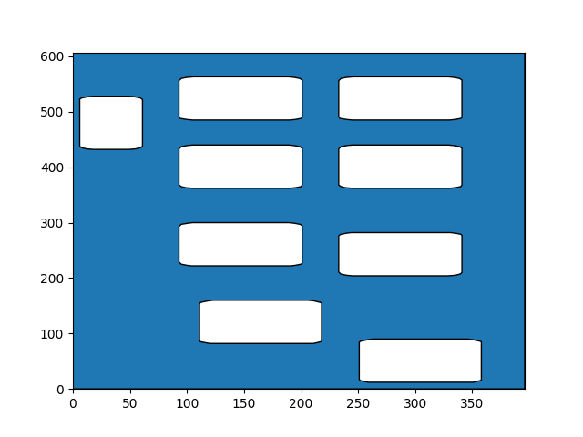
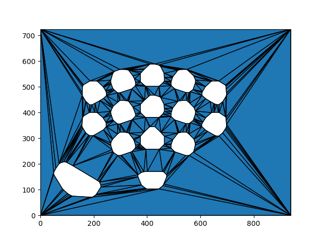
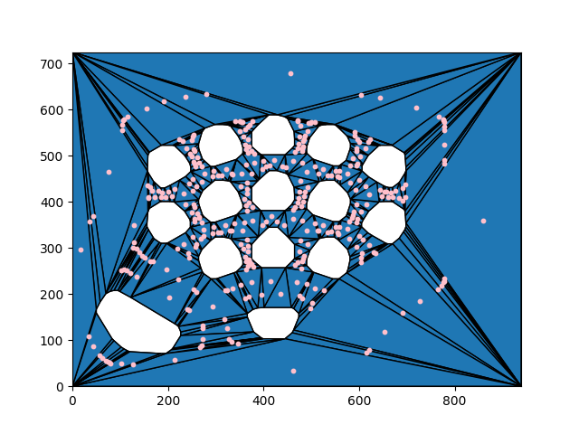
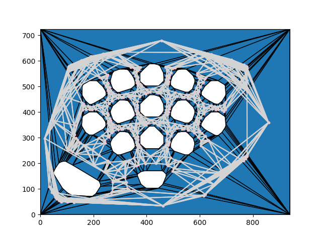
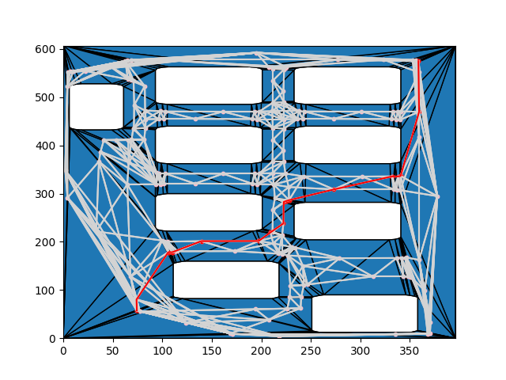

# Path Planning Using Constrained Delaunay Triangulation
## Authors: Keshawn Boughton & Nadezhda Dominguez
## Computational Geometry Fall 2025

## Overview
This file contains implementation example of the path planning using constrained Delauay Triangulation. Given an image of a classroom environment, we find the obstacles within it and set them as
obstacle polygons, construct the envrionemnt and obstacles as polygons, find the centroids of the CDT and build a graph connecting adjacent centroids, then compute the shortest path avoiding
obstacles between a starting and end point (centroids) using Dijkstra's. 

## How to Run Our Code

Our main code file, PolygonBreakdown.py, containing our pipleine was written in Python, it contains descriptive docstrings for each of the functions created to help outline our process.

Required to install the following: 

- numpy
- opencv-python
- shapely (version 2.0 or higher)
- matplotlin
- networkx

You may install all using:

pip install numpy opencv-python shapely matplotlib networkx

## Running Our Program

1. Place an image of a classroom into the sample/classrooms file if you would like to use a new example. Then in the ConvexHullTakeTwo.py file change the input for img =  cv2.imread("sample_classrooms/circle_classroom.png"). The default setting is the circle_classroom.
2. Run the program of PolygonBreakdown.py by pressing the top right run button on the file, or if using terminal type python PolygonBreakdown.py
3. The resulting visualizations of each step in our pipeline will be store to the path_progression folder.

## Explanation of How the Code Works

### Obstacle Detection

The first step in the pipeline is to extract the obstacles from the classroom image. Using OpenCV, the classroom image is processed with Canny edge detection in order to identify the object boundaries.
Then, the convex hulls are computed based on these edges to give a good convex hull representation of the tables/chairs/desks in the classroom. These obstacles are then represented as polygonal holes inside the classroom boundary.

Given the input classroom image:

Convex Hulls Computed for Obstacles:

### Polygonal Environment

The class is set up to be a rectangular polygon with the dimensions set to match the image inserted in the beginning. The obstacle convex hulls are then placed as holes within this polygon. Therefore it outputs a 
polygonal region that has polygonal holes, which demonstrate the area available for path planning and a potential robot to navigate.

### Constrained Delaunay Triangulation

Using Shapely, we compute the constrained Delaunay triangulation (CDT) of the space inside the classroom environment excluding the obstacles. The triangulation is able to avoid triangulating within the obstacle boundaries, and therefore
triangles are not contained within obstacle polygons. 

### Computing Centroid & Centroid Graph

From the CDT, we compute each of the triangle's centroid and place it as a node in a graph using Networkx graph. Then, if two of the triangles are adjacent, then an edge is added between their centroids, as long as the edge being added does not cross any obstacle polygon boundaries.
The edges are then weighted by distance between the centroids and the graphs represents the possible paths one may take between two points in the environment.

### Finding the Shortest Path

Lastly, the proposed start and end point are plotted to find the closest triangle centroids, as the path navigation is based on our centroid graph. Then, Dijsktra's algorithm is used on the centroid graph to find the shortest path between the two points.
The result is a shortest path which successfully avoids crossing any obstacle polygons, and the path is made up of centroids from the CDT.

## Conclusion

### References

