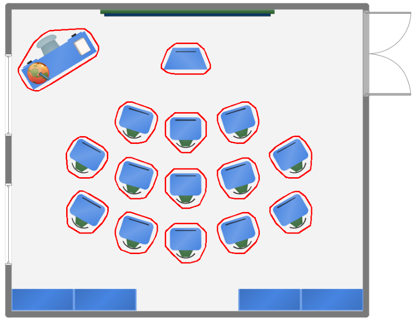

# Path Planning Using Constrained Delaunay Triangulation
## Authors: Keshawn Boughton & Nadezhda Dominguez
## Computational Geometry Fall 2025

## Overview
This file contains implementation example of the path planning using constrained Delauay Triangulation. Given an image of a classroom environment, we find the obstacles within it and set them as
obstacle polygons, construct the envrionemnt and obstacles as polygons, find the centroids of the CDT and build a graph connecting adjacent centroids, then compute the shortest path avoiding
obstacles between a starting and end point (centroids) using Dijkstra's. 

## How to Run Our Code

Our main code file, CDTPath.py, containing our pipeline to find the shortest path was written in Python using Shapely and Networkx libraries, the file contains descriptive docstrings for each of the functions created to help outline our process. The code which takes in the classroom environment image and creates the convex hulls is in ConvexHullObstacles.py.

Required to install the following: 

- numpy
- opencv-python
- shapely (version 2.0 or higher)
- matplotlib
- networkx

You may install all using:

pip install numpy opencv-python shapely matplotlib networkx

## Running Our Program

1. Place an image of a classroom into the sample_classrooms folder if you would like to use a new environment example. Then in the ConvexHullObstacles.py file change the input for, img =  cv2.imread("sample_classrooms/circle_classroom.png"), to the new classroom environment png name. The default setting is the circle_classroom example.
2. Run the program in CDTPath.py by pressing the top right run button on the file, or if using the terminal type python CDTPath.py into the terminal and press enter.
3. The resulting visualizations of each step in our pipeline will be stored in the path_progression folder.

## Explanation of How the Code Works

### Obstacle Detection

The first step in the pipeline is to extract the obstacles from the classroom image. Using OpenCV, the classroom image is processed with Canny edge detection in order to identify the object boundaries.
Then, the convex hulls are computed based on these edges to give a good convex hull representation of the tables/chairs/desks in the classroom. These obstacles are then represented as polygonal holes inside the classroom boundary.

Given the input classroom image, created the convex hulls of the obstacles:

  
  

### Polygonal Environment

The class is set up to be a rectangular polygon with the dimensions set to match the image inserted in the beginning. The obstacle convex hulls are then placed as holes within this polygon. Therefore it outputs a 
polygonal region that has polygonal holes, which demonstrate the area available for path planning and a potential robot to navigate.

  

### Constrained Delaunay Triangulation

Using Shapely, we compute the constrained Delaunay triangulation (CDT) of the space inside the classroom environment excluding the obstacles. The triangulation is able to avoid triangulating within the obstacle boundaries, and therefore
triangles are not contained within obstacle polygons. 

  

### Computing Centroid & Centroid Graph

From the CDT, we compute each of the triangle's centroid and place it as a node in a graph using Networkx graph. Then, if two of the triangles are adjacent, then an edge is added between their centroids, as long as the edge being added does not cross any obstacle polygon boundaries.
The edges are then weighted by distance between the centroids and the graphs represents the possible paths one may take between two points in the environment.

  
  

### Finding the Shortest Path

Lastly, the proposed start and end point are plotted to find the closest triangle centroids, as the path navigation is based on our centroid graph. Then, Dijsktra's algorithm is used on the centroid graph to find the shortest path between the two points.
The result is a shortest path which successfully avoids crossing any obstacle polygons, and the path is made up of centroids from the CDT.

  

## Conclusion

The project implemented a CDT based path planning strategy that effectively produced a shortest path for a robot when given a classroom environment with obstacles. This planning strategy was solely programmed in Python, using its various libraries. Our environment involved the traversable space in a classroom, which excluded the set $H$ of obstacles in the classroom. This environment was constructed using Python's OpenCV. Then the environment was triangulated and used to make a viable path using Python's Shapely. Through identifying obstacles in the environment, computing the constrained triangulation, building a centroid graph, and applying Dijkstra's algorithm, we obtained an optimum path for a robot to navigate a classroom.

## References

1. Gene Eu Jan, Chien-Hung Lin, and Chih-Yung Hsu.  
   **Obstacle avoidance path planning based on Delaunay triangulation for mobile robots.**  
   *IEEE Access*, 9:137894–137905, 2021.

2. Gillies, S., et al.  
  **Shapely: Manipulation and Analysis of Geometric Objects, Constrained Delaunay Triangulation.**  
  Python package, version 2.1.0. https://shapely.readthedocs.io/

